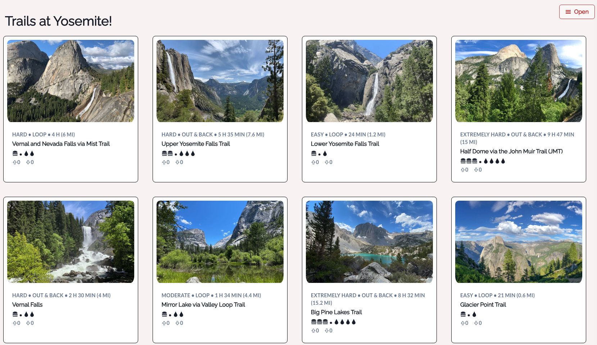

# Park Guide
> A national park trip planning application focused on curating and delivering the best trip experience for users.

## Table of contents
* [General info](#general-info)
* [Project Demo](#project-demo)
* [Technologies](#technologies)
* [Setup](#setup)
* [Features](#features)
* [Inspiration](#inspiration)
* [Contact](#contact)

## General info
Park Guide is an easy to use national park planning application that helps provide users with the best experience possible. Users can find lodging, food, and trail information for Yosemite National Park. 

<div align="center">Welcome to Park Guide. </div>
<div align="center">

</div>
<br/>
<div align="center">
<kbd>

</kbd>
</div>

<br/>
<div align="center">
<kbd>

</kbd>
</div>

## Project Demo 
[Click to view site](pacific-basin-76343.herokuapp.com/)

## Technologies
### Backend Development 
* Ruby
* Ruby on Rails
* PostgreSQL

### Frontend Development 
* JavaScript
* HTML
* CSS
* React.js
* React-DOM
* React-Router-DOM
* Chakra-UI
* Google Maps API
* Weather.gov API

## Setup
To try out this project: 
1. Clone the GitHub repository locally to your computer
1. In the command line, navigate to the root directory of the repository, and type the following: 
  $ npm install 
1. Navigate to the client folder, and in the root directory of the client folder, type the following: 
  $ npm install 
1. In the client folder, and in the root directory of the client folder, type the following: 
  $ npm start
1. Navigate back to the root directory of this project, type the following:
  $ bundle install
1. In the root directory of this project, start the server by typing the following: 
  $ rails s

## Code Examples
### Ruby/Rails
```Rails
def special_create
  user_id =uf_params[:user_id]
  food_id = uf_params[:food_id]
  uf_w_all = UserFood.find_by user_id: user_id, food_id: food_id

  
  if uf_w_all
      uf_instance = uf_w_all
      uf_instance.update(uf_params)
      
  else
      uf_instance = UserFood.create(uf_params)
  end
  render json: uf_instance, status: :created
end
```

### JavaScript/React.js 
```React.js
const [weatherData, setWeatherData] = useState([])
useEffect(() => {
    const getWeatherData = async() => {
        let req = await fetch(`https://api.weather.gov/points/${starting_lat},${starting_long}`);
        console.log(req)
        if(req.ok){
            let res = await req.json()
            // console.log(res)
            const get_forecast = async() => {
                let w_req = await fetch(res.properties.forecast)    
            
                if(w_req.ok){
                    let data = await w_req.json()
                    setWeatherData(data.properties.periods)
                }
            }
            get_forecast()
        }
    }
    if(starting_lat % 1 !==0){
        getWeatherData()
    }
        
},[starting_lat, starting_long])
```


## Features
* Full stack web application utilizing React.js and Ruby on Rails.
* Authorization and authenication implemented with bcrypt. 
* Front-End styles built with Chakra.UI and CSS.
* Users can create account through application. 
* Users can upvote, downvote, comment, and favorite lodging, trails, and restaurants.
* Locations and weather data for lodging, trails, and restaurants are displayed.

## Status
Project is finished with option to expand functionality and to refactor code. 

## Inspiration
The inspiration for Park Guide came from the times I tried to plan a trip to a national park. I was frustrated by the lack of consolidated data and a way for me to know what was highly rated at the park. I decided to create Park Guide to try and help alleviate that for people that wanted to see the beauty of national parks in the US.

## Contact
Created by [Joseph Shin](https://www.linkedin.com/in/joseph-sw-shin/) 
Feel free to contact me for any questions! 

