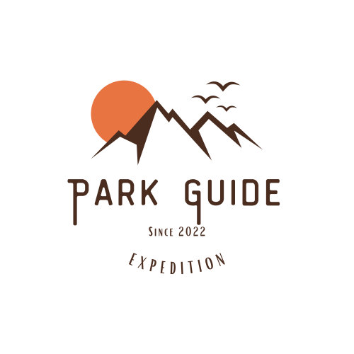

<!-- Improved compatibility of back to top link: See: https://github.com/othneildrew/Best-README-Template/pull/73 -->

<!--
*** Thanks for checking out the Best-README-Template. If you have a suggestion
*** that would make this better, please fork the repo and create a pull request
*** or simply open an issue with the tag "enhancement".
*** Don't forget to give the project a star!
*** Thanks again! Now go create something AMAZING! :D
-->

<!-- PROJECT LOGO -->
 

  

  <h1 align="center">Park Guide</h3>

<!-- TABLE OF CONTENTS -->

  
Table of Contents

  <ol>
    <li>
      <a href="#about-the-project">About The Project</a>
      <ul>
        <li><a href="#built-with">Built With</a></li>
      </ul>
    </li>
    <li>
      <a href="#getting-started">Getting Started</a>
      <ul>
        <li><a href="#prerequisites">Prerequisites</a></li>
        <li><a href="#installation">Installation</a></li>
      </ul>
    </li>
    <li><a href="#usage">Usage</a></li>
    <li><a href="#roadmap">Roadmap</a></li>
    <li><a href="#contact">Contact</a></li>

  </ol>

<!-- ABOUT THE PROJECT -->
## About The Project

[![Product Name Screen Shot][page-demo]]("https://pacific-basin-76343.herokuapp.com/")

Have you ever had difficulties when trying to plan a trip to a national park/nature site?

If so, Park Guide might be what you need!

Park Guide is a national park trip planning website focused on the user experience and the opinions of those users.

Users can:
* Upvote, downvote, and favorite the different lodging, trails, and restaurants in the area
* Upload lodging, trails, and restaurants when new ones are added
* See how much water and food they should bring to trails
* See what the weather is like at those locations

I've built this website using a scaffold that I forked from Flatiron School in order to make it compatible with Heroku.

(<a href="#readme-top">back to top</a>)

### Built With

<ol>
    <li>React</li>
    <li>Javascript</li>
    <li>Ruby</li>
    <li>Ruby on Rails</li>
    <li>Chakra UI</li>
    <li>Google Maps API</li>
    <li>Weather.gov API</li>
</ol>

(<a href="#readme-top">back to top</a>)

<!-- USAGE EXAMPLES -->
## Usage

Please feel free to try and break my website and let me know what you find!

If you want to learn how to use the Google Maps API, check out my blog post here: https://dev.to/jss475/google-maps-with-react-4n1o

(<a href="#readme-top">back to top</a>)

<!-- ROADMAP -->
## Roadmap

- [ ] Flush Out Submit Validations
- [ ] Add More National Parks
- [ ] Switch weather APIs
- [ ] Mobile Phone Compatible

(<a href="#readme-top">back to top</a>)

<!-- CONTACT -->
## Contact

Joseph Shin - shin.seung.won@gmail.com

Project Link: [https://github.com/jss475/phase-5-project](https://github.com/jss475/phase-5-project)

(<a href="#readme-top">back to top</a>)

<!-- MARKDOWN LINKS & IMAGES -->
[page-demo]: ./client/public/screen_shot.png
[Ruby_img]: https://www.ruby-lang.org/images/header-ruby-logo.png
[Ruby-url]: https://www.ruby-lang.org/en/